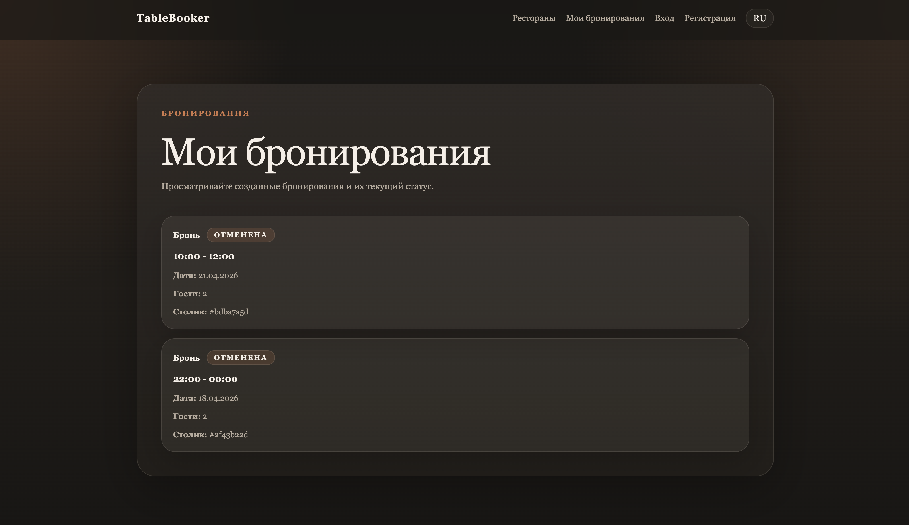
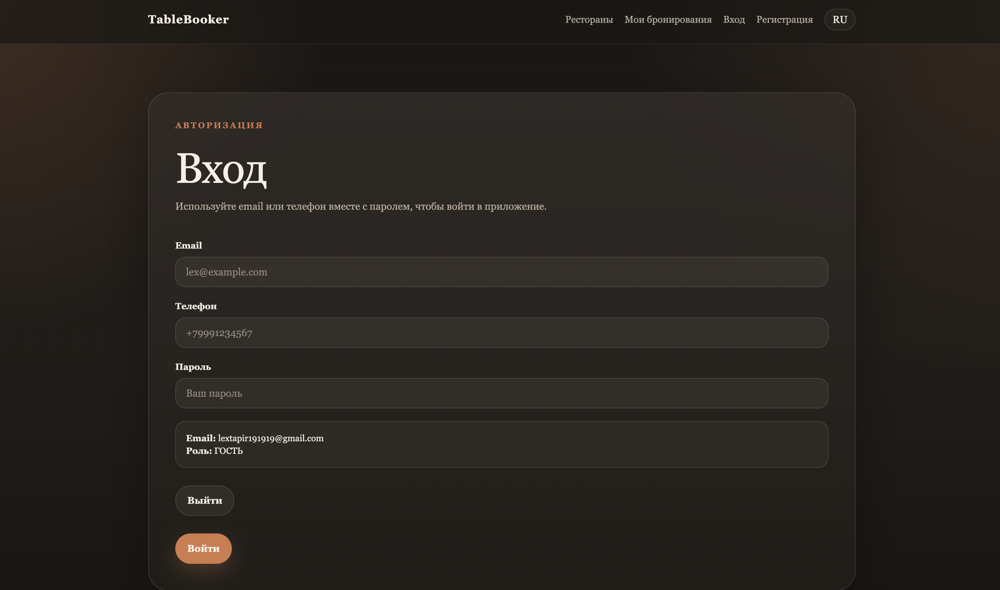
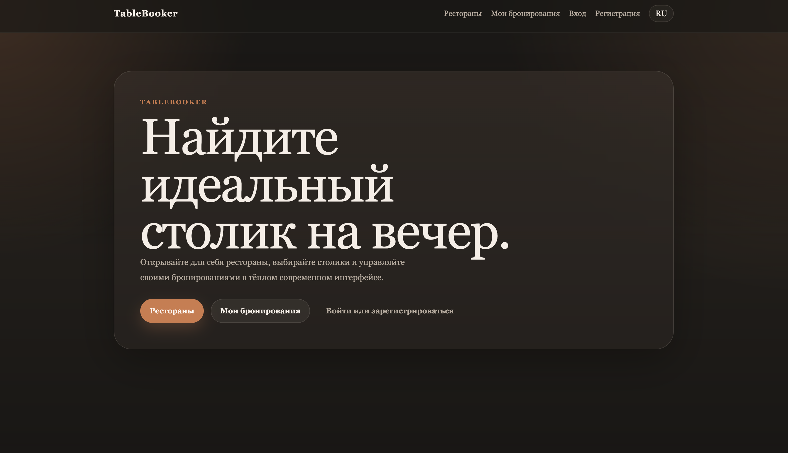

# TableBooker

Fullstack restaurant booking platform built with a microservice architecture (gRPC + event-driven).

## 🚀 Demo
👉 https://table-booker.ru/

## 🖼 Interface

### Landing


### Core flow (RU)



### Russian (i18n support)


## 🔥 Key Features

- JWT authentication (HttpOnly cookies)
- Full booking lifecycle (create / confirm / cancel)
- Booking expiration (TTL)
- Redis caching & rate limiting
- Microservices (auth / booking / notification)
- gRPC + RabbitMQ communication

## 🧠 Why this project matters

This is not just CRUD. It demonstrates:

- service separation
- sync + async communication
- failure-tolerant design
- real booking domain logic (conflicts, expiration)

## 🛠 Tech Stack

Next.js · NestJS · PostgreSQL · Redis · RabbitMQ · gRPC · Docker

<details>
<summary>📚 Full technical description</summary>

## Overview

TableBooker is a fullstack restaurant booking platform built as a microservice system.

It demonstrates how a real-world backend can evolve from a simple modular application into a more production-like architecture with:

- synchronous communication via gRPC
- asynchronous event-driven flows via RabbitMQ
- caching and rate limiting via Redis
- resilient notification delivery (email + SMS)
- meaningful automated test coverage

The focus of this project is not on CRUD, but on **architecture, reliability, and system evolution over time**.

## Why This Project Matters

This project showcases:

- how to split a monolith into multiple services with clear boundaries
- how services communicate using both sync (gRPC) and async (RabbitMQ) patterns
- how to design a system that continues to work even when parts of it fail
- how to implement real-world auth flows (access + refresh tokens, logout invalidation)
- how to move from manual testing to structured automated tests

It reflects backend engineering challenges rather than isolated toy features.

## What I Learned

While building this project, I focused on:

- designing service boundaries and responsibilities
- implementing inter-service communication (gRPC)
- building event-driven flows with RabbitMQ
- handling partial failures in notification delivery
- using Redis for both caching and rate limiting
- writing meaningful e2e tests instead of only unit tests
- working with PostgreSQL using raw SQL instead of an ORM
- structuring a project for scalability and clarity

This project represents a transition from writing code to thinking in terms of systems.

## Current State

The project now includes both a production-like backend and a working frontend MVP.

Implemented:

- three Nest applications:
  - `auth-service`
  - `booking-service`
  - `notification-service`
- user registration and login with:
  - `email`
  - `phone`
  - `email + phone`
- JWT auth with:
  - `accessToken`
  - `refreshToken`
  - logout with refresh token invalidation
- current user resolution through protected endpoints
- booking creation on behalf of the authenticated user
- booking confirmation and cancellation
- booking conflict detection by time
- support for `REGULAR` and `SHARED` tables
- automatic expiration of `HOLD` bookings
- `gRPC` communication between `booking-service` and `auth-service`
- Redis-backed:
  - auth rate limiting
  - read caching for restaurant data
- RabbitMQ-based booking events
- notification dispatching through:
  - email
  - SMS
- graceful notification behavior:
  - skip missing email
  - skip missing phone
  - continue when one provider fails
- frontend MVP in `apps/web` with:
  - login / register / logout
  - restaurants browsing
  - restaurant details and tables
  - booking creation
  - my bookings screen
  - confirm / cancel actions
  - `RU / EN` language toggle with persisted locale
  - centralized UI text dictionary
  - refresh-token-based session continuation through `httpOnly` cookie
  - `accessToken` kept in `localStorage` for protected frontend requests
  - dark themed responsive UI

## Applications

The monorepo currently contains three backend services and one frontend app:

- [apps/auth-service](./apps/auth-service)
- [apps/booking-service](./apps/booking-service)
- [apps/notification-service](./apps/notification-service)
- [apps/web](./apps/web)

### Auth Service

Responsible for:

- `users` table
- register / login / refresh / logout / me
- JWT issuance and validation
- password hashing with `argon2`
- auth rate limiting via Redis
- `gRPC` methods for other services

Main HTTP endpoints:

- `POST /auth/register`
- `POST /auth/login`
- `POST /auth/refresh`
- `POST /auth/logout`
- `GET /auth/me`

Auth supports flexible contact input:

- register with `email`
- register with `phone`
- register with both
- login by `email`
- login by `phone`

Current session model:

- `refreshToken` is issued as `httpOnly` cookie
- `accessToken` is returned to the frontend and stored in `localStorage`
- `POST /auth/refresh` uses the cookie-based refresh flow
- logout invalidates the refresh cookie-backed session

### Booking Service

Responsible for:

- `restaurants`
- `restaurant_tables`
- `bookings`
- booking conflict detection
- booking status changes
- hold expiration scheduler
- read cache through Redis
- publishing booking events to RabbitMQ

Main HTTP endpoints:

- `GET /restaurants`
- `GET /restaurants/:id`
- `GET /restaurants/:id/tables`
- `GET /tables/:id`
- `POST /bookings`
- `PATCH /bookings/:id/confirm`
- `PATCH /bookings/:id/cancel`
- `GET /bookings/my`

Important rule:

- `POST /bookings` does not accept `userId` from the client
- `booking-service` resolves the current user through `auth-service` over `gRPC`

### Notification Service

Responsible for:

- consuming booking events from RabbitMQ
- dispatching notifications by channel
- sending email notifications
- sending SMS notifications
- handling partial delivery gracefully

It reacts to:

- `booking.confirmed`
- `booking.cancelled`

And can send:

- booking confirmation email
- booking cancellation email
- booking confirmation SMS
- booking cancellation SMS

### Web App

Responsible for:

- user auth screens
- current session handling in the UI
- restaurants browsing flow
- restaurant details flow
- booking creation flow
- my bookings flow
- booking confirm / cancel actions
- UI localization and language switching

Main frontend routes:

- `/`
- `/login`
- `/register`
- `/restaurants`
- `/restaurants/:id`
- `/bookings`

Frontend UX notes:

- Russian is the default language
- users can switch between `RU` and `EN`
- selected language is preserved across page reloads

## Architecture

### Core Flow

1. A user registers or logs in through `auth-service`.
2. The frontend receives an `accessToken`, while the `refreshToken` is stored in an `httpOnly` cookie.
3. The client sends protected requests with the `accessToken`.
4. When needed, the frontend restores session state through `POST /auth/refresh` using the cookie.
5. The client sends a booking request to `booking-service`.
6. `booking-service` validates the current user through `auth-service` over `gRPC`.
7. A booking is created with status `HOLD`.
8. Booking status changes can publish domain events to RabbitMQ.
9. `notification-service` consumes those events and dispatches notifications through available channels.

### Communication

- HTTP for public APIs
- `gRPC` between `booking-service` and `auth-service`
- RabbitMQ between `booking-service` and `notification-service`

### Shared Contracts

The project keeps shared contracts in [libs/contracts](./libs/contracts).

The auth `gRPC` contract is described in:

- [proto/auth.proto](./proto/auth.proto)

## Booking Domain

### Main Entities

- `users`
- `restaurants`
- `restaurant_tables`
- `bookings`

### Booking Statuses

- `HOLD`
- `CONFIRMED`
- `CANCELLED`
- `EXPIRED`

### Hold Expiration

When a booking is created, it starts in `HOLD`.

If it is not confirmed in time, a scheduled job changes it to `EXPIRED`, and the slot becomes available again.

## Tech Stack

- NestJS
- Next.js
- React
- TypeScript
- Tailwind CSS
- TanStack Query
- React Hook Form
- Zod
- PostgreSQL
- `postgres` driver without ORM
- Redis
- RabbitMQ
- Swagger
- `@nestjs/schedule`
- JWT + Passport
- `argon2`
- `gRPC`
- `nodemailer`
- external SMS provider integration
- Docker Compose
- GitHub Actions
- Jest + Supertest

## Testing

The project now has separate backend and frontend automated test layers.

### Backend Coverage

Backend coverage includes:

- auth e2e scenarios
- booking e2e scenarios
- `gRPC` integration flow
- Redis-backed integration checks
- booking event publishing tests
- notification consumer tests
- notification dispatcher tests
- email provider tests
- SMS provider tests

Current backend suite size:

- `40` e2e tests
- `16` notification and service-level specs
- `56` backend tests total

Useful backend commands:

```bash
yarn test:e2e
